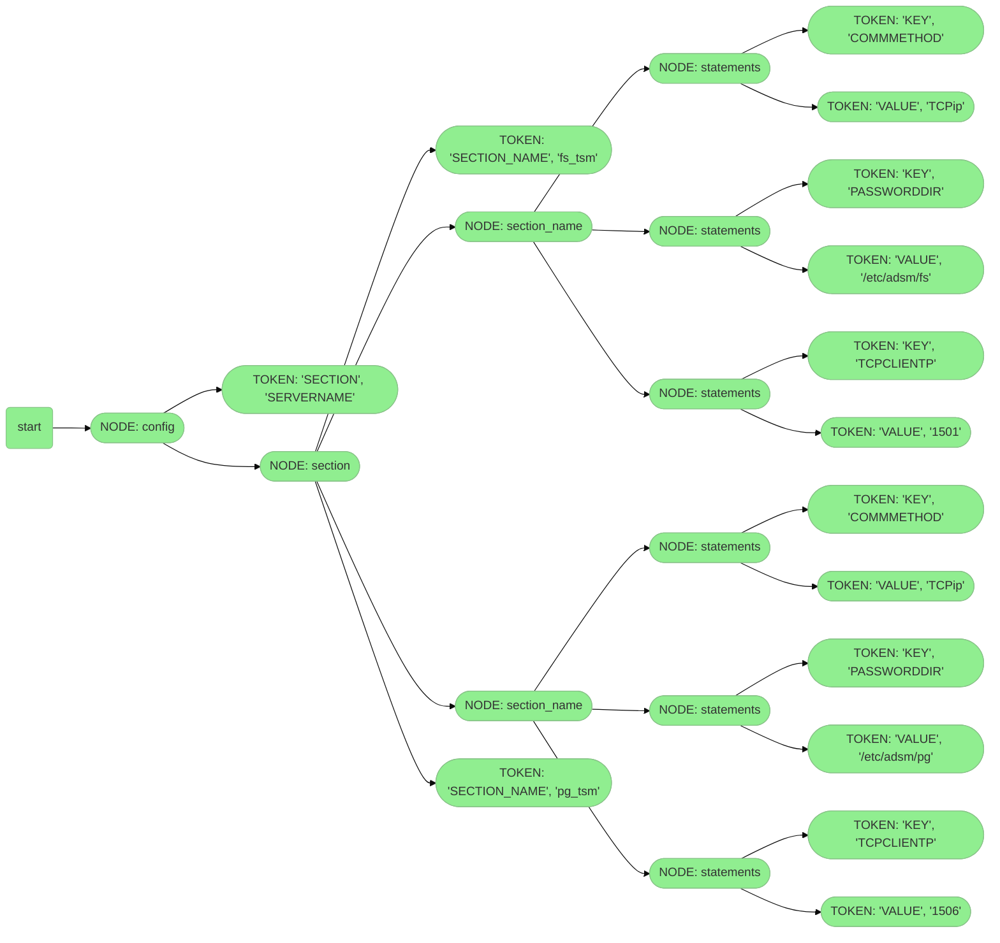

# Модуль для редактирования файла **dsm.sys**
Управление (добавление, удаление, изменение) отдельных параметров в файле **dsm.sys** без необходимости изменения файла в целиком. 
Тогда, когда использование **ansible.builtin.template** или **ansible.builtin.assemble** недопустимо, из-за нехватки исходных данных для шаблонищирования.

### Описание

Конфиг **dsm.sys** парсится с помощью **Lark** по подготовленной грамматике.
Результат работы парсера - дерево, в котором нодами являются начало секции и имена параметров.
С помощью класса **TreeToJson(Transformer)** преобразуем дерево в промежуточное представление в виде python **dict()**.
Методы работы со словарем по внесенмию изменений в конфиг реализованы в классе **DsmsysOperations()**, методы для stanza и statements контекстно разнесены по отдельным классам, с помощью декоратора **@property**.
Классы **Stanza()** и **Option()** ссылаются на свое свойство **@property** в классе **DsmsysOperations()**.
После внесения изменений в **dict()** собираем конфиг в исходный формат и повторно прогоняем парсером по грамматике.
В случае успеха считаем, что конфиг валиден и записываем его по пути, указанному в переменной **path**.
Файл **dsm.sys** парсится и перезаписывается целиком. 
>Особеннсти:
>- параметры в исходном файле преобразуются в **верхний** регистр
>- регистр значений остаётся без изменений
>- закомментированные строки сохраняются

### Зависимости
Внешних зависимостей нет, используется заране подготовленный парсер Lark_StandAlone.
```
python -m lark.tools.standalone grammar.lark > standalone.py
```
Версия ansible должна быть **2.9.20** или выше.

### Пример использования
> Необходимо изменить значение параметра **tcpserveraddress** в станзе **pg_tsm**
```
- name: update dsm.sys
  rbru.unix.dsmsys_file:
    path: /opt/tivoli/tsm/client/ba/bin/dsm.sys
    section: pg_tsm
    option: tcpserveraddress
    value: backup-server.domain.tld
    state: present
  register: result
```

> Тыдыщ
```
TASK [ansible-rbru.install_tsm : update dsm.sys] *
changed: [s-msk-t-uss-ap1]
```

>Здесь для иллюстрации приведена только измененная секция
```
SERVERNAME              pg_tsm
COMMMETHOD              TCPip
TCPCLIENTP              1506
PASSWORDDIR             /etc/adsm/pg
NODENAME                FOOBARFOOBAR
ERRORLOGNAME            /opt/tivoli/tsm/client/ba/bin/dsmerror_pg.log
SCHEDLOGRETENTION       7,D
ERRORLOGRETENTION       7,D
PASSWORDACCESS          generate
TCPSERVERADDRESS        backup-server.domain.tld
SCHEDLOGNAME            /opt/tivoli/tsm/client/ba/bin/dsmsched_pg.log
```

### Дерево на mermaid для понта




